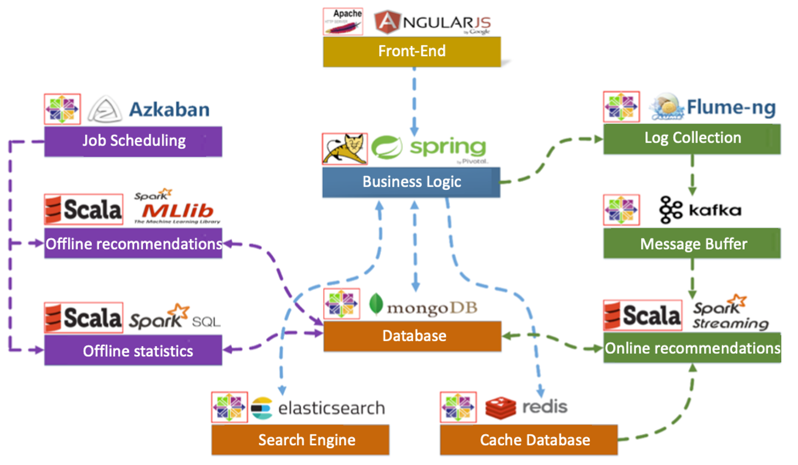

# Movie-Recommendation-Engine
## Project Architecture

## Contributing
- Developed a full-stack web service to improve movie searching and recommendation experience based on personalized information.
- Designed a dynamic website to implement user interaction and present movie recommendation results utilizing React.
- Created back-end server with RESTful APIs to implement business logic utilizing Spring Boot with a Tomcat web server.
- Designed database schema and used Spark SQL to preprocess movie information data to store into ElasticSearch and MongoDB.
- Improved user’s watching experience utilizing content-based, statistics recommendation, and Spark ALS model.

end.
